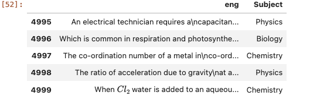
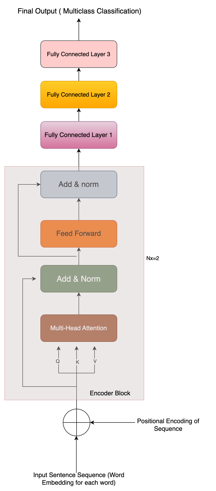
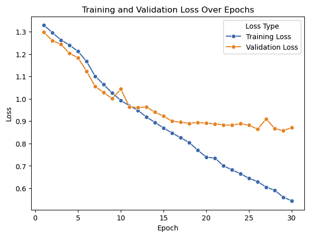
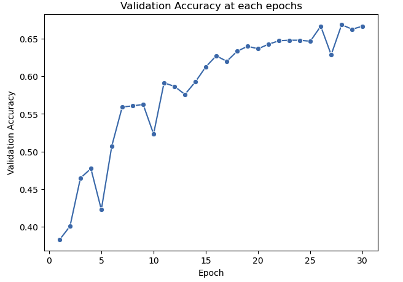
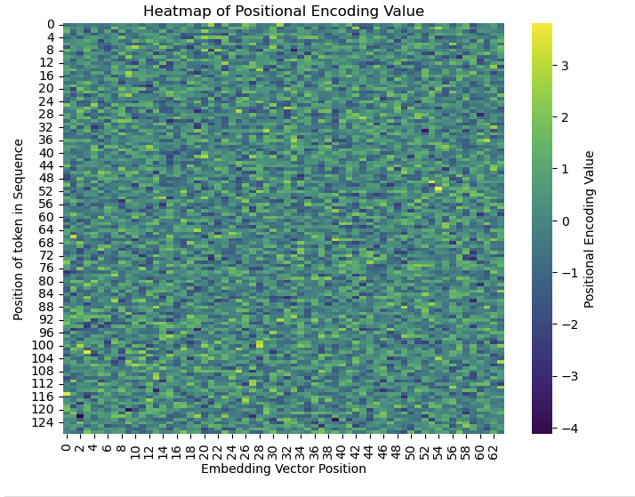

### Q1. Suppose that we design a deep architecture to represent a sequence by stacking self-attention layers with positional encoding. What could be issues? 
**Computational Complexity**: For each self-attention layer it takes n^2 ( where n is length of sequence) computational complexity, and if multiple self-attention head stacked together then computational complexity become n^2*m ( where m is number of self-attention head). But i can say there won't be much issues with shorter sequences but with longer sequences this will reduce the computational speed.

**Vanishing Gradient**: As the neural network become deeper then in that case the gradient updated become difficult during backpropagation. To avoid this with skip connection is used with multi-head attention architecture. 

**Positional Encodings**: Due to parallel processing the Multi-head self attention layers didn't capture the notion of position of token in sequence and its importance. So, selection of positional encoding method ( fixed or trainable) and how incorporate this encoding with input sequence is also a challenging task. For fixed positional encoding, there might be chances that for some depth of encoding vector every values become same, in that case we have to analyse and fix the issue. 

### Q2. Training of Learnable Positional Encoding using Multihead Self Attention Mechanism
##### Architecture Diagram of Model (Self Attentional Model)

#### 2.1 Problem Statement:

Problem Statement: For given text sequence, can we predict the for which subject i.e Chemistry, Maths, Biology, or Physics.

#### 2.2 Solution: 
I have taken the dataset in which each data point have text sequence and labelled subject against it.

#### 2.3. Multi-head Self-Attention based Transformer model Architecture:

In this case model is also learning the Word Embeddings along with positional encoding. 
Positional encoding is initialized randomly for each position in sequence. For each position the position encoding vector have same size of word embedding vector. 
As there are issues related to vanishing gradient for deep neural network during backpropagation, in this Encoder block skip connection added, so that deep neural network will be easily trained without having the vanishing gradient issues.

### 2.4 Model Configuration:

The following parameters are used to configure the model:

- **vocab_size**: 23311
  - The size of the vocabulary, i.e., the total number of unique tokens.

- **d_model**: 64
  - The embedding vector length for each token.

- **num_heads**: 8
  - The number of self-attention heads in the model.

- **num_layers**: 2
  - The number of times the encoder layer is repeated.

- **max_seq_len**: 128
  - The maximum sequence length for the input data.

- **num_classes**: 4
  - The number of output classes, corresponding to the categories: Biology, Chemistry, Maths, and Physics.

- **batch_size**: 32
  - The number of samples per batch during training.

- **num_epochs**: 30
  - The number of epochs (complete passes through the training dataset).

- **learning_rate**: 1e-4
  - The learning rate for the optimizer.

#### 2.5 Model Training:

From above it is clear that training and validation loss is decreasing with each epochs, this shows that model is converging. Also good sign that validation accuracy is also increasing.

#### 2.6 Visualization of Final Encoding Learned Encoding

From above graph, it is clear that for each  position in a sequence and Embedding vector position (depth) that value of encoding is different. So we can say that while training the model for multiclass classification model has learned positional encoding. This might be better solution than the fixed positional encoder based on sine and cosine.
#### Future Improvement Scopes:
1. Text preprocessing a part such as removing the unwanted punctuation, links. 
2. Can we add custom loss that is focus on learning the positional encoding.
3. Pretrained Embedding vector can be used that is trained on huge corpus. Which help to focus more on learning the positional encodings rather then Learning word embedding and positional embedding at same time. 
4. Hyperparameter tuning

